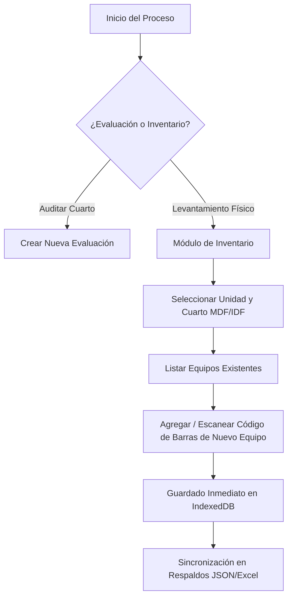

# Propuesta de Diseño: Inventario de Equipamiento en Cuartos de Comunicaciones

> [!NOTE]
> **ESTADO: COMPLETAMENTE IMPLEMENTADO (Julio 2026)**
> Esta funcionalidad ha sido integrada y liberada en la versión **1.1.0** de la aplicación móvil local, incluyendo soporte offline total, catalogación inteligente de 148 modelos, entradas personalizadas de marca/modelo y exportación cruzada de hojas de cálculo de Excel.

Este documento presenta la propuesta técnica y de interfaz para incorporar un módulo de **Inventario de Equipamiento** al actual *Sistema de Evaluación de Cuartos de Telecomunicaciones*. El objetivo es permitir el levantamiento y control de activos físicos (switches, ruteadores, UPS, etc.) en sitio de forma **100% offline**, vinculando los equipos directamente a las unidades y cuartos de comunicaciones (MDF/IDF) existentes.

---

## 1. Visión y Flujo de Funcionamiento

El módulo de inventario operará bajo la misma premisa arquitectónica del sistema actual: **offline-first**. El flujo de trabajo típico de un ingeniero en campo sería el siguiente:



### Características de Operación:
* **Escaneo con Cámara Móvil:** Integración de una librería cliente ligera (como `html5-qrcode`) para escanear números de serie de los equipos a través de la cámara del dispositivo sin requerir internet.
* **Catálogos Oficiales de Dispositivos:** Integración directa del catálogo delegacional que especifica las marcas y modelos válidos para cada tipo de equipo, reduciendo errores humanos de captura.
* **Vinculación con Evaluaciones:** Al realizar una evaluación en un cuarto, el sistema mostrará un resumen del equipamiento inventariado para comprobar si coincide con el estado físico observado.

---

## 2. Propuesta de Interfaz de Usuario (UI/UX)

La interfaz se adaptará de forma fluida a la estética actual (Gris obscuro/Esmeralda) utilizando componentes de Shadcn/ui y TailwindCSS.

### A. Integración en el Dashboard Principal
Se agregará una nueva tarjeta de estadísticas y un botón de acceso rápido en el panel de control:
* **Métrica en Dashboard:** "Equipos Inventariados" (número total de activos registrados en IndexedDB).
* **Acción Rápida:** "Gestionar Inventario" (conduce a la vista de búsqueda delegacional).

### B. Vista de Gestión e Historial de Activos (Mockup Conceptual)
Una tabla interactiva con búsqueda global y filtros avanzados:
```text
+------------------------------------------------------------------------------------------------+
|  [🔍 Buscar por Serie, Unidad...]                                    [⚙️ Filtrar por Tipo ▾]     |
+------------------------------------------------------------------------------------------------+
| Unidad           | Cuarto   | Tipo    | Marca / Modelo          | Num. Serie  | Estado         |
+------------------+----------+---------+-------------------------+-------------+----------------+
| UMF 36 OTAY      | MDF      | SWITCH  | Cisco Catalyst 9300 48P | FOC1827X01  | Operativo      |
| HGZ-MF 8 ENS     | IDF 1    | UPS     | APC Smart-UPS 3000      | AS19082348  | Dañado/F.S. ⚠️ |
| OOADBC           | MDF      | ROUTER  | Cisco ISR 4331          | FDO2145A2B  | Operativo      |
+------------------+----------+---------+-------------------------+-------------+----------------+
| [ + Agregar Nuevo Activo ]                                          Página 1 de 12 [>]         |
+------------------------------------------------------------------------------------------------+
```

### C. Formulario de Captura de Activo (Wizard / Modal)
Formulario optimizado para pantallas táctiles en dispositivos móviles con los siguientes campos:
1. **Ubicación:** Unidad Médica y Cuarto (MDF/IDF) seleccionados de los catálogos existentes.
2. **Tipo de Equipo:** Selector rápido basado en el catálogo oficial:
   * `CORE`
   * `DVR`
   * `MODEM`
   * `NTU`
   * `PBX`
   * `ROUTER`
   * `SWITCH`
   * `UPS`
3. **Marca y Modelo:** Catálogos dependientes según el tipo de equipo seleccionado para evitar capturas manuales incorrectas.
4. **Número de Serie:** Input de texto + Botón de **[📷 Escanear con Cámara]**.
5. **Estado Operativo:** Botones de opción única:
   * `Operativo`
   * `Requiere Mantenimiento`
   * `Dañado/Fuera de Servicio`
6. **Detalles de Conectividad (Llenado Opcional):**
   * Cantidad de puertos (Numérico)
   * Puertos ocupados (Numérico)
   * Dirección MAC (MAC Address)
   * Dirección IP (IP Address)

---

## 3. Modelo de Datos Propuesto (IndexedDB)

Para soportar esta estructura, se propone extender la base de datos IndexedDB (`telecom-imss`) agregando una nueva tienda (store) llamada `equipos`.

### Estructura de la Colección `equipos`:
```json
{
  "id": "EQ-71594-001",                     // ID Único auto-generado (EQ-unitId-consecutivo)
  "unitId": 71594,                           // ID de la Unidad (ej. UMR CAMALÚ)
  "roomId": "ID71594CUARTO1",                // ID del Cuarto (ej. MDF)
  "tipo": "SWITCH",                          // CORE, DVR, MODEM, NTU, PBX, ROUTER, SWITCH, UPS
  "marca": "Cisco",
  "modelo": "Catalyst 9300 48P",
  "numeroSerie": "FOC2240X87F",
  "estado": "Operativo",                     // Operativo, Requiere Mantenimiento, Dañado/Fuera de Servicio
  "puertosTotales": 48,                      // Opcional (null si no se captura)
  "puertosOcupados": 32,                     // Opcional (null si no se captura)
  "macAddress": "00:0A:95:9D:68:16",         // Opcional (null si no se captura)
  "ipAddress": "192.168.1.10",               // Opcional (null si no se captura)
  "observaciones": "Enlazado al switch principal de la unidad.",
  "fechaRegistro": "2026-07-02T13:45:00Z",
  "registradoPor": "12345678"                // Matrícula del evaluador activo
}
```

---

## 4. Integración y Salidas (PDF & Excel)

### A. Reporte de Evaluación PDF
* En el reporte PDF principal de la evaluación del cuarto se agregará una sección en la segunda hoja titulada **"Inventario de Equipamiento en Sitio"**, mostrando una lista compacta con los equipos registrados, su marca, modelo, número de serie y estado operativo.

### B. Reporte Excel Consolidado
* Al exportar los respaldos a formato Excel (`xlsx`), se incluirá una **segunda pestaña** en el libro titulada **`Equipamiento`**, donde se listarán de forma tabular todos los equipos inventariados de las unidades seleccionadas. Esto permitirá a la Coordinación Delegacional tener un concentrado completo de activos de toda la delegación Baja California para planeaciones presupuestales de reemplazo.

### C. Módulo de Respaldos JSON
* El archivo de respaldo `.json` individual y global incluirá el nodo de `equipos` relacionado para asegurar que toda la información histórica se guarde o se pueda restaurar en otro dispositivo sin pérdida de datos.
