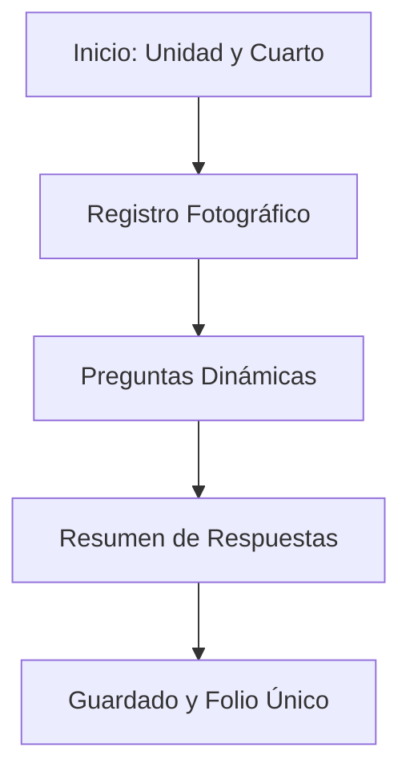

# Manual de Usuario
## Sistema de Evaluación de Cuartos de Telecomunicaciones (IMSS)
### Coordinación Delegacional de Informática — OOAD Baja California

Este documento proporciona una guía detallada para el uso del **Sistema de Evaluación de Cuartos de Telecomunicaciones**, una Aplicación Web Progresiva (PWA) diseñada para funcionar 100% sin conexión a internet (offline), permitiendo a los ingenieros de telecomunicaciones del IMSS realizar auditorías y levantamientos directamente en sitio de manera ágil y profesional.

---

## Índice
1. [Introducción y Conceptos Clave](#1-introducción-y-conceptos-clave)
2. [Instalación de la Aplicación (PWA)](#2-instalación-de-la-aplicación-pwa)
3. [Registro Inicial de Evaluador](#3-registro-inicial-de-evaluador)
4. [El Panel de Control (Dashboard)](#4-el-panel-de-control-dashboard)
5. [Realización de una Nueva Evaluación](#5-realización-de-una-nueva-evaluación)
6. [Módulo de Inventario de Equipamiento](#6-módulo-de-inventario-de-equipamiento)
7. [Historial y Detalle de Evaluaciones](#7-historial-y-detalle-de-evaluaciones)
8. [Gestión de Respaldos de Información](#8-gestión-de-respaldos-de-información)
9. [Configuración del Sistema](#9-configuración-del-sistema)
10. [Solución de Problemas y Preguntas Frecuentes](#10-solución-de-problemas-y-preguntas-frecuentes)

---

## 1. Introducción y Conceptos Clave

El sistema sustituye los procesos tradicionales en papel o plataformas semi-locales (como AppSheet), ofreciendo una solución moderna que se ejecuta por completo en el navegador del dispositivo (teléfono inteligente, tableta o computadora portátil).

### Características Fundamentales:
* **Operación Offline:** Una vez cargada por primera vez, la aplicación no requiere internet ni plan de datos para funcionar.
* **Almacenamiento Local Seguro:** Toda la información recolectada se almacena localmente en la base de datos del navegador (**IndexedDB**).
* **Generación de Reportes al Instante:** Los reportes en formato **PDF institucional (formato 2025)** y **Reporte Fotográfico PDF** se generan localmente en el dispositivo sin necesidad de servidores externos.
* **Seguridad de Datos:** No requiere cuentas, contraseñas ni APIs externas. Tu información permanece en tu dispositivo hasta que decidas exportarla o respaldarla de forma manual.

---

## 2. Instalación de la Aplicación (PWA)

Para aprovechar al máximo el sistema (pantalla completa, acceso directo en inicio, funcionamiento sin barras del navegador), se recomienda instalarlo como PWA.

### En Dispositivos Android (Google Chrome):
1. Abre el enlace de la aplicación en Chrome.
2. Espera a que aparezca un mensaje flotante en la parte inferior que dice **"Agregar a la pantalla de inicio"** o presiona los tres puntos verticales en la esquina superior derecha.
3. Selecciona **"Instalar aplicación"** o **"Agregar a la pantalla principal"**.
4. Confirma la instalación. Ahora tendrás el ícono institucional del IMSS en tu menú de aplicaciones.

### En Dispositivos iOS / iPhone (Safari):
1. Abre el enlace de la aplicación en el navegador **Safari** (obligatorio en iOS).
2. Toca el botón **"Compartir"** (el ícono de un cuadrado con una flecha apuntando hacia arriba en la barra inferior).
3. Desplázate hacia abajo y selecciona **"Agregar a inicio"** (Add to Home Screen).
4. Escribe el nombre de la app y presiona **"Agregar"**.

### En Computadoras (Windows / macOS / Linux - Chrome o Edge):
1. Abre la aplicación en tu navegador web.
2. En la barra de direcciones (donde escribes la URL), aparecerá un ícono con forma de computadora y una flecha, o un botón que dice **"Instalar"**.
3. Haz clic en él y selecciona **"Instalar"**.
4. La aplicación se abrirá en una ventana independiente libre de barras del navegador.

> [!IMPORTANT]
> **Requisito de Seguridad:** Las funciones offline y la instalación como PWA requieren obligatoriamente que la aplicación esté alojada en un servidor seguro con protocolo **HTTPS** (por ejemplo, en servidores como Netlify, Vercel o Cloudflare).

---

## 3. Registro Inicial de Evaluador

La primera vez que abras la aplicación, el sistema te redirigirá a la pantalla de **Registro de Evaluador**. Estos datos son obligatorios y aparecerán firmando todos los reportes PDF que generes.

### Campos a rellenar:
1. **Nombre Completo:** Tu nombre y apellidos.
2. **Matrícula:** Tu identificador oficial del IMSS (se guarda de forma fija para evitar capturas repetitivas).
3. **Ciudad:** Selecciona tu delegación u oficina de adscripción (las opciones por defecto corresponden a las 5 ciudades de Baja California).
4. **Unidad Delegacional:** Dependiendo de la ciudad que elijas, el sistema filtrará automáticamente las unidades médicas/administrativas válidas para esa zona.

Una vez validados los campos, presiona **"Comenzar"** para acceder al panel principal.

---

## 4. El Panel de Control (Dashboard)

El Dashboard es tu centro de operaciones. Se compone de las siguientes áreas:

* **Estadísticas de Uso (Tarjetas superiores):**
  * **Evaluaciones Completadas:** Número total de auditorías guardadas en el dispositivo.
  * **Última Evaluación:** Fecha de la última inspección registrada.
  * **Borradores Activos:** Indica si tienes un proceso de evaluación a medias.
  * **Espacio Usado:** Estimación del espacio utilizado en el almacenamiento local (principalmente fotos).
* **Acciones Rápidas:**
  * **Nueva Evaluación:** Inicia el asistente de auditoría.
  * **Historial:** Lista de auditorías realizadas con anterioridad.
  * **Respaldos:** Descarga y subida de datos.
  * **Ajustes:** Edición de perfil y consulta técnica.
* **Recuperación Inteligente de Borradores:** Si saliste accidentalmente del asistente antes de guardar, en el Dashboard aparecerá una alerta en amarillo para **"Recuperar Borrador"**. 
  * > [!TIP]
    > **Reanudación Automática:** Al continuar una evaluación guardada como borrador, el sistema **no volverá a solicitar la Unidad ni el Cuarto**. El asistente detectará tus datos y saltará automáticamente al paso donde te quedaste (al paso de Fotografías si no habías respondido preguntas, o a la pregunta exacta en la que cancelaste el llenado, por ejemplo, la pregunta 23).
* **Actividad Reciente:** Listado rápido de las últimas 5 evaluaciones realizadas con acceso directo a sus detalles.

---

## 5. Realización de una Nueva Evaluación

El proceso de evaluación se realiza mediante un asistente paso a paso (Wizard) diseñado para optimizar el tiempo de llenado en campo.

### Paso 1: Selección de Unidad y Cuarto
* **Buscador de Unidades:** Comienza a escribir el nombre de la Unidad Médica o Administrativa (por ejemplo: *HGR 1* o *UMF 36*). El sistema autocompletará la búsqueda basándose en el catálogo oficial de 74 unidades de Baja California.
* **Tipo de Cuarto:** Selecciona el cuarto específico a evaluar (por ejemplo: *Site Principal*, *IDF Piso 2*, etc.). Se cargan automáticamente los cuartos registrados en catálogo.
* El sistema autocompletará la información técnica conocida del cuarto. Presiona **"Siguiente"**.

### Paso 2: Evidencia Fotográfica (Fotos del Sitio)
Puedes tomar o subir fotografías directamente desde la cámara de tu celular o desde el almacenamiento del equipo.
* Haz clic en **"Tomar fotografía"** o **"Seleccionar desde galería"** para capturar la evidencia.
* Las fotos se optimizan y se guardan como archivos internos (Blobs) en la base de datos IndexedDB.
* > [!TIP]
  > Para no saturar el almacenamiento de tu celular, sube únicamente las fotografías críticas y necesarias para documentar las anomalías o cumplimientos.

### Paso 3: Cuestionario Dinámico (Preguntas)
El cuestionario consta de 41 preguntas organizadas por secciones (Control, Energía, UPS, Infraestructura, etc.) bajo la normativa del Anexo A 2025. El sistema utiliza **lógica inteligente** para facilitar la captura:
* **Auto-avance:** Al responder una pregunta de opción múltiple (Sí / No / Cumple / No Cumple), el sistema esperará 400ms y avanzará automáticamente a la siguiente pregunta. Puedes desactivar esta opción si prefieres avanzar de forma manual.
* **Preguntas Condicionales (Ocultación Inteligente):** 
  * Si marcas que **No** hay ciertos conmutadores en el cuarto, la pregunta 7 y otras preguntas técnicas innecesarias se ocultarán automáticamente.
  * Si indicas que el número de Servidores o Switches es **0**, el sistema ocultará las preguntas referentes a su estado y mantenimiento.
* **Lógica en Preguntas de Objetos Ajenos (Q011):** Las opciones para evaluar el orden en esta sección son `'Libre de objetos ajenos'` (opción conforme) y `'No esta libre'` (opción no conforme). Seleccionar `'No esta libre'` precargará de manera automática la recomendación correctiva *"Retirar objetos ajenos en el cuarto."* en el resumen.

### Paso 4: Resumen y Firma
Antes de guardar, verás una pantalla con la puntuación de cumplimiento obtenida, las recomendaciones generadas automáticamente y las observaciones que desees capturar manualmente.
* Revisa las respuestas.
* Presiona **"Guardar evaluación"**.
* El sistema generará un número de folio único con la estructura: **`EVA-AAAAMMDD-HHMMSS`** (por ejemplo: `EVA-20260701-153045`).

---

## 6. Módulo de Inventario de Equipamiento

El sistema cuenta con un módulo offline completo para el levantamiento de activos físicos en los cuartos de comunicaciones (MDF / IDF), accesible desde el botón **"Inventario"** del Dashboard principal.

### Vista del Inventario:
* **Búsqueda Dinámica**: Filtra en tiempo real por número de serie, marca, modelo, dirección MAC o IP.
* **Filtros Avanzados**: Despliega filtros colapsables por Ciudad, Unidad Médica, Cuarto específico (MDF/IDF) y Tipo de dispositivo para depurar listas extensas.
* **Exportación Rápida a Excel**: Un botón **"Excel"** en la cabecera te permite descargar inmediatamente los activos visibles en pantalla (`inventario_filtrado.xlsx`), respetando la búsqueda y los filtros que tengas aplicados.

### Captura de un Nuevo Activo:
1. **Ubicación**: El sistema heredará la Ciudad y Unidad de tu perfil de evaluador activo de forma automática, aunque puedes modificarlas de ser necesario. Selecciona el Cuarto (MDF/IDF) correspondiente.
2. **Especificación del Dispositivo**:
   - **Tipo de Dispositivo**: Selecciona la categoría (`CORE`, `DVR`, `MODEM`, `NTU`, `PBX`, `ROUTER`, `SWITCH`, `UPS`).
   - **Marca y Modelo**: El sistema cargará el catálogo de marcas y modelos oficiales asociados al tipo seleccionado.
   - **Dispositivo Personalizado ("Otro")**: Si el modelo físico no figura en el catálogo, selecciona la opción *"Otro (Agregar Personalizado)"* e ingresa la marca y modelo correspondientes. El sistema los registrará localmente y recordará para futuras selecciones sin obligarte a escribirlos de nuevo.
3. **Número de Serie**: Captura de forma manual el número de serie físico impreso en el chasis del equipo.
4. **Estado Operativo**: Selecciona el estado en el que se encuentra el activo (`Operativo`, `Requiere Mantenimiento` o `Dañado/Fuera de Servicio`).
5. **Detalles de Conectividad (Opcional)**: Habilita el registro de puertos totales, puertos activos ocupados, dirección MAC física, dirección IP de administración del equipo y observaciones adicionales de interés técnico.

Presiona **"Guardar Equipo"** para persistir el activo. El sistema registrará el cambio de inmediato en la base de datos local del navegador.

---

## 7. Historial y Detalle de Evaluaciones

En el módulo **Historial**, verás una tabla con todas las auditorías realizadas en el dispositivo. 

### Opciones Disponibles en el Detalle de cada Evaluación:
1. **Detalle (Lectura):** Acceso a la ficha completa de la auditoría. Una vez finalizada, la evaluación es **inmutable** (no se puede editar en sus respuestas para garantizar la integridad de la auditoría).
2. **Generar/Descargar PDF (Reporte de Evaluación):** Crea y descarga un archivo PDF institucional de 2 columnas, cumpliendo estrictamente los requisitos de presentación del IMSS para el año 2025 (logotipos, firmas, desglose de calificaciones y observaciones).
3. **Generar/Descargar Reporte Fotográfico:** Genera y descarga un PDF independiente dedicado de forma exclusiva a las fotografías registradas en la evaluación (4 fotos por hoja en una cuadrícula de 2x2).
4. **Generar/Descargar Oficio de Evaluación:** Abre un formulario flotante interactivo para ingresar o actualizar los datos del destinatario:
   * **Nombre y Puesto del Director** (por ejemplo: *C. Dr. Francisco Javier García* / *Director del HGR 20*)
   * **Tipo de Atención**: Permite elegir entre *Administrador*, *Ingeniero de Conservación* u *Otro*.
   * **Nombre (Atención)**: El nombre del destinatario técnico a quien se atiende.
   * **Especificar Cargo**: Permite detallar si es *Encargado*, *Responsable*, *Titular*, etc. (o ingresar un cargo libre personalizado en caso de elegir la opción *Otro*).
   * > [!TIP]
     > El sistema recuerda y almacena localmente estos campos para que no tengas que escribirlos de nuevo en futuras auditorías. Genera un reporte formal con texto **justificado** dirigido al Director que detalla de forma ordenada la lista de requerimientos (recomendaciones surgidas de la auditoría) de esa Unidad Médica específica, el espacio para firma y el área para sello físico de la Unidad.
5. **Compartir Archivos:** Permite enviar los documentos generados (Evaluación, Reporte Fotográfico y Oficio) a través de WhatsApp, correo electrónico, etc.
   * > [!IMPORTANT]
     > **Botón JSON exclusivo de Respaldos:** Para simplificar la pantalla del asistente y detalle, el botón de exportación individual de datos en formato JSON se movió de forma exclusiva a la sección de **Respaldos**.

---

## 8. Gestión de Respaldos de Información

Dado que toda la información se guarda localmente en el dispositivo, es vital realizar respaldos periódicos.

### A. Exportar a EXCEL (Novedad):
En la parte superior de la sección de Respaldos dispones del panel **Exportar Evaluaciones a Excel**:
1. Selecciona el **Tipo de Filtro** deseado:
   * **Todas las evaluaciones:** Exporta el historial completo almacenado.
   * **Por año:** Muestra un menú dinámico para exportar las auditorías de un año específico (por ejemplo, `2026`).
   * **Por rango de fechas:** Abre selectores de calendario para definir una fecha de inicio y una fecha de fin de búsqueda.
2. Presiona **"Exportar a Excel"** para descargar un archivo `.xlsx`.
3. > [!NOTE]
   > El Excel resultante contiene un registro por fila de todas las evaluaciones filtradas, detallando metadatos completos, evaluador, unidad, cuarto, puntaje final, observaciones, recomendaciones y las respuestas individuales a cada una de las 41 preguntas de catálogo (excluyendo fotos), ideal para análisis masivos o reportes estatales.

### B. Descargar Respaldos Individuales por Evaluación:
En el listado inferior, cada tarjeta de evaluación te permite generar y descargar cuatro formatos independientes:
* **PDF:** El reporte institucional del formato de evaluación.
* **Fotos (PDF):** El reporte fotográfico de 4 imágenes por hoja.
* **Oficio (PDF):** El oficio oficial de evaluación dirigido al Director con la lista de requerimientos (se autogenera con datos por defecto si no lo habías creado).
* **JSON:** El archivo de datos estructurados de la auditoría.
* Cuenta además con botones de **Compartir** para cada uno de estos cuatro formatos.

### C. Copias de Seguridad del Sistema Completo:
* **Exportar Respaldo Completo:** Presiona **"Generar Respaldo"** para empaquetar todas las evaluaciones y fotos en un solo archivo JSON global que sirve de salvaguarda.
* **Importar Respaldo:** Elige un archivo de respaldo JSON generado previamente y presiona **"Restaurar"** para consolidar los datos de otra computadora o celular en el dispositivo actual.

---

## 9. Configuración del Sistema

En la pantalla de **Configuración** podrás realizar las siguientes tareas:
* **Editar Datos del Evaluador:** Modifica tu nombre, ciudad o unidad delegacional de adscripción en caso de reubicación (el campo matrícula se mantiene bloqueado para evitar alteraciones accidentales).
* **Catálogos Completos:** Consulta la base de datos interna de Ciudades, Unidades Médicas, Cuartos y Preguntas normativas.
  * > [!NOTE]
    > Se ha garantizado que el **100% de las 74 unidades médicas** cuenten con al menos un cuarto de telecomunicaciones en su catálogo correspondiente. Se añadió el cuarto **MDF** para la unidad **ID 33 (CENTRO SEG SOC SLRC)**, la cual se encontraba previamente vacía.

---

## 10. Solución de Problemas y Preguntas Frecuentes

### 1. ¿Por qué no me aparece la opción de instalar la aplicación?
* Asegúrate de estar ingresando desde un navegador compatible (Chrome en Android, Safari en iOS, Edge/Chrome en Windows).
* Verifica que la dirección URL del sistema empiece con `https://`. Si la URL empieza con `http://` (servidor no seguro), el navegador bloqueará las capacidades de instalación por seguridad.

### 2. ¿Perderé mis evaluaciones si cierro el navegador o apago el celular?
* **No.** Toda la información se guarda automáticamente en la memoria no volátil del navegador (**IndexedDB**). Puedes cerrar la app, reiniciar el dispositivo o apagarlo y tus datos seguirán ahí.

### 3. He borrado el historial y los datos de navegación de Chrome, ¿qué pasará con mis evaluaciones?
* **¡Cuidado!** Si seleccionas la opción de borrar "Cookies y datos de sitios" o realizas una limpieza profunda del almacenamiento en la configuración de Android para tu navegador, el navegador podría eliminar la base de datos de IndexedDB. **Te recomendamos generar un archivo de respaldo (.json) frecuentemente para evitar pérdidas.**

### 4. ¿Cómo comparto un reporte PDF por WhatsApp o Correo desde mi celular?
* Una vez que tocas en **"Generar PDF"** desde el detalle de la evaluación, el sistema creará el documento y abrirá el visor de PDF nativo de tu celular. Desde allí, utiliza la función estándar del sistema operativo para "Compartir" o "Enviar archivo" y selecciona tu aplicación de correo o mensajería favorita.
